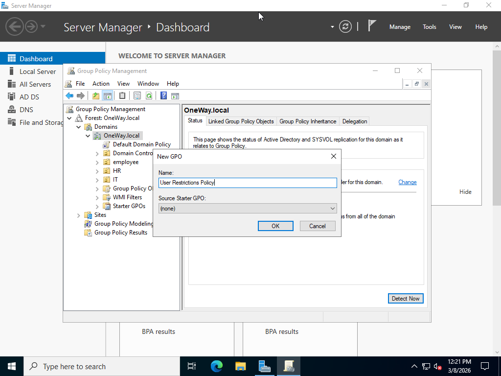
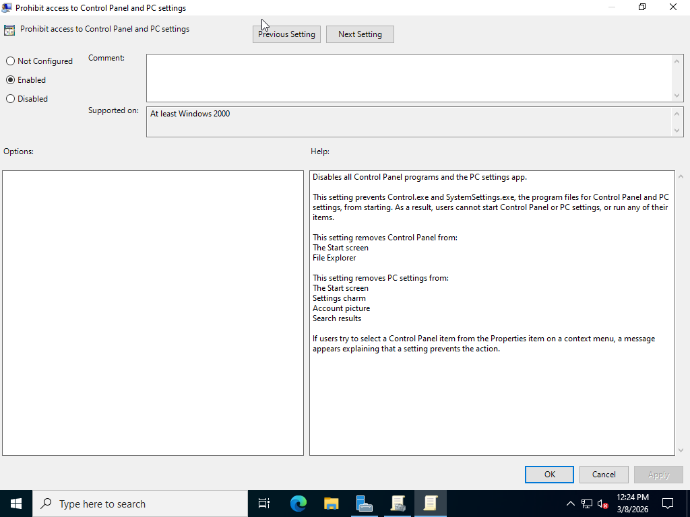
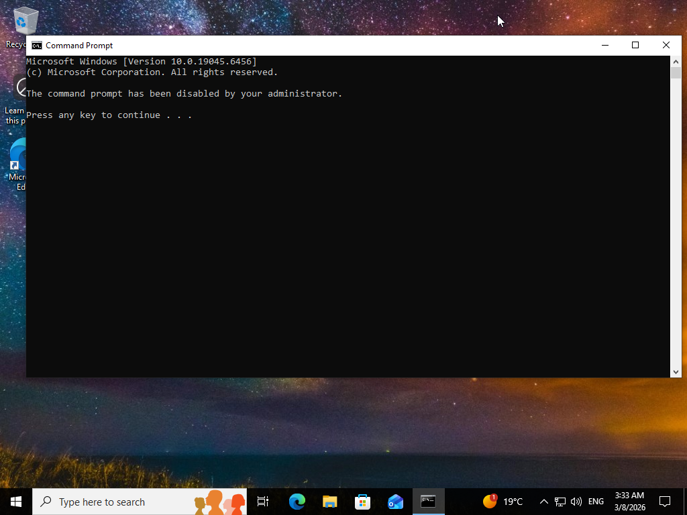
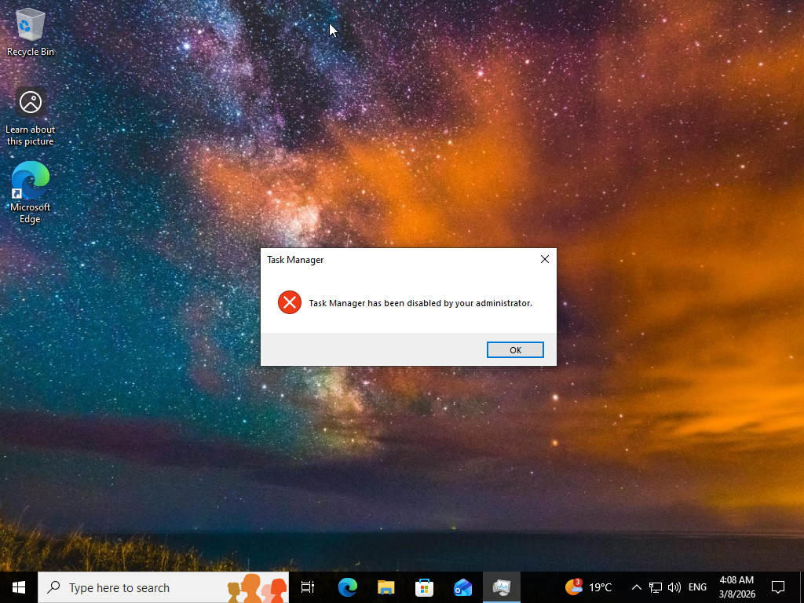

# Group-Policy-Security-Lab
Implementing security restrictions using Group Policy in a Windows Server environment

# Group Policy Security Lab

## Overview
This lab demonstrates implementing security restrictions using Group Policy in a Windows Server Active Directory environment.

## Lab Environment

- Windows Server 2022 (Domain Controller)
- Domain: OneWay.local
- Windows Client (Domain Joined)

## Implemented Policies

- Disabled Control Panel access
- Prevented Command Prompt usage
- Disabled Task Manager

## Skills Learned

- Group Policy Management
- Security Hardening
- Domain Policy Deployment

- ## Screenshots

### Group Policy Creation

### Control Panel Disabled

### Command Prompt Disabled

### Task Manager Disabled

